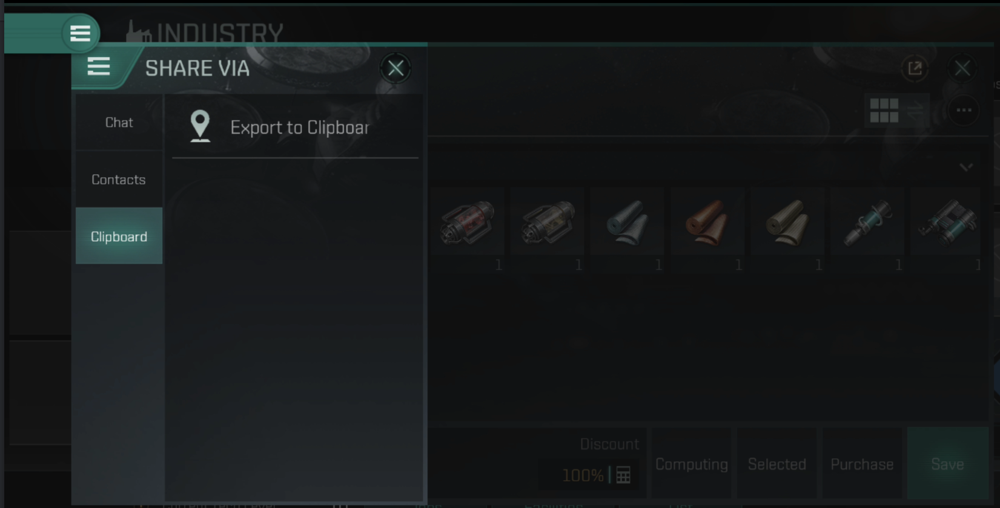

# A Constellation, Planet, and Resource harvesting problem

The only resources available in a constellation are found on planets. The decision about how many array's should be placed per resource is to made based on constellation and manufacturing requirements considerations. The crate has static data for the resource output per hour, planet, and constellation.  The requirments are exported from the game and read from the clipboard.



The list includes the quantity and up-to-date estimated valuation.  The valuation is used to determine the per-unit value when solving the system of linear inequalities for maximum total value.

```
ID	Names	Quantity	Valuation 
1	Silicate Glass	1	1011.34 
2	Smartfab Units	1	418.3 
3	Liquid Ozone	1	166.13 
4	Reactive Gas	1	195.65 
5	Noble Gas	1	363.2 
6	Industrial Fibers	1	1199.78 
7	Supertensile Plastics	1	512.55 
8	Polyaramids	1	102.93 
9	Coolant	1	607.45 
10	Condensates	1	346.7 
11	Construction Blocks	1	381.78 
12	Nanites	1	1448.58 
```


## System of Linear Inequalities

To solve the optimization problem, you need to have exported a list of requirements which inclues the valuation. The `create_outpost` function will allow you to configure anchored capsuleer outposts. Pass those two variables to the `solve_for_constellation` function with the number of days between fuels.  For example:

```rust
use material_lp::{create_outpost, solve_for_constellation};

let outposts = vec![
    create_outpost("Outpost1", "Tanoo", "Aaron", "Corporation A", "Alliance A", "test"),
    create_outpost("Outpost2", "Tanoo", "Benjamin", "Corporation A", "Alliance A", "test"),
    create_outpost("Outpost3", "Tanoo", "Caroline", "Corporation A", "Alliance A", "test"),
    create_outpost("Outpost4", "Futzchag", "David", "Corporation A", "Alliance A", "test"),
    create_outpost("Outpost5", "Futzchag", "Emily", "Corporation A", "Alliance A", "test"),
    create_outpost("Outpost6", "Futzchag", "Fiona", "Corporation A", "Alliance A", "test"),
];
let materials = parse_decomposed_list("ID	Names	Quantity	Valuation 
1	Silicate Glass	1	1011.34 
2	Smartfab Units	1	418.3 
3	Liquid Ozone	1	166.13 
4	Reactive Gas	1	195.65 
5	Noble Gas	1	363.2 
6	Industrial Fibers	1	1199.78 
7	Supertensile Plastics	1	512.55 
8	Polyaramids	1	102.93 
9	Coolant	1	607.45 
10	Condensates	1	346.7 
11	Construction Blocks	1	381.78 
12	Nanites	1	1448.58 
").unwrap();

let results = solve_for_constellation(outposts, materials, 7.);
```
